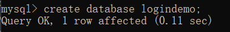
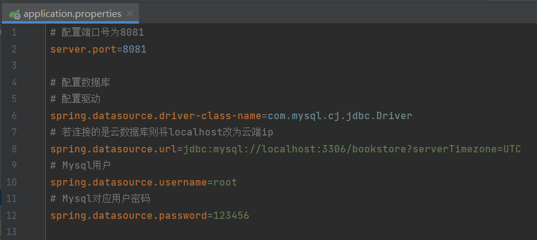
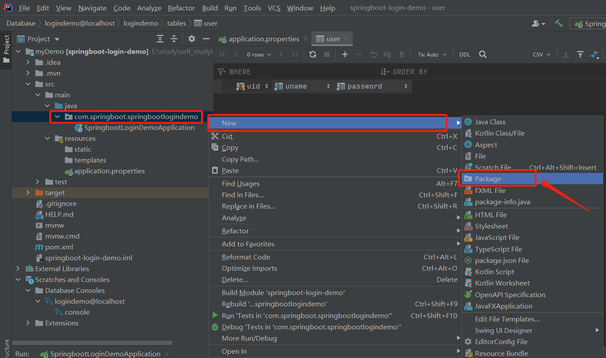
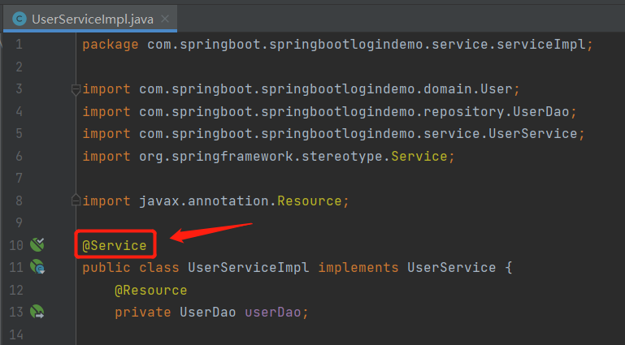

---
head:
  - - meta
    - name: og:description
      content: 本文章对SpringBoot开发后端项目结构做了简单介绍，并示范了使用SpringBoot+MySQL实现登录的后端功能。
  - - meta
    - name: keywords
      content: SpringBoot MySQL 登录 注册 前后端分离
---

# 快速上手SpringBoot项目（登录注册保姆级教程）

`作者：MakerHu`

> 本文章对SpringBoot开发后端项目结构做了简单介绍，并示范了使用SpringBoot+MySQL实现登录的后端功能，与本站的另一篇文章 [Vue 实现登录注册功能（前后端分离完整案例）](/practice/vue/vue-login-demo) 共同组成了前后端分离项目的整体，适合小白上手 Vue + SpringBoot + Mysql 的项目开发。


文章由作者本人转载至本站，原地址：[快速上手SpringBoot项目（登录注册保姆级教程） | MakerHu的博客](https://www.makerhu.com/posts/5b2ca0db/)


**如果大家遇到问题并解决，可以及时向我反馈，我会把大家的解决方案补充到文章最后，以供他人参考，大家遇到问题也可以先到文末查看是否已有解决方案**


**前后端完整项目演示：** 


**本文章只涉及后端教程**，前端教程请看本人的另一篇文章：

**前端教程：**[Vue 实现登录注册功能（前后端分离完整案例）](/practice/vue/vue-login-demo)

## 前置条件

使用本教程的前置条件是开发环境中已安装了以下几个东西，若无可以先找相关教程安装配置好。

**管理工具：** maven

**IDE：** IDEA

**数据库：** MySQL

**测试工具：** Postman（非必须，但方便测试且安装和使用都挺简单的）

## 创建项目

**注意：创建项目时保持网络通畅**

1. 打开IDEA

   

2. 新建项目

   情况一：

   

   情况二：

   

   设置项目的基本信息，其中注意jdk版本要与Java版本匹配，这里使用jdk1.8和java8


选择SpringBoot版本，选择项目依赖（依赖可以创建完项目后在pom文件中修改）


至此项目就创建完成啦！

## 目录结构（初始状态）


## 配置数据库

创建完项目后，如果直接运行项目，我们会发现项目报错了


报错的原因是我们在创建项目时导入了数据库相关的依赖，但是项目却还没有进行数据库相关配置

所以接下来我们先进行数据库的配置

### 创建数据库

要配置数据库，首先咱们得有个数据库，因此我们先用MySQL创建一个。由于本项目要演示登录注册功能的实现，所以在此我将创建一个用户表，保存用户的账号信息。

1. 按Win+R打开“运行”，输入cmd


2. 输入`mysql -u root -p`后输入密码，登录MySQL

   

3. 创建数据库`create database logindemo`**logindemo**为数据库名，根据你的情况修改

   

4. 进入数据库`use logindemo`

   

5. 创建user表

   ```sql
   CREATE TABLE user
   (
       uid int(10) primary key NOT NULL AUTO_INCREMENT,
       uname varchar(30) NOT NULL,
       password varchar(255) NOT NULL,
       UNIQUE (uname)
   );
   ```

   

   uid: 用户编号，主键，自增

   uname: 用户名，作为登录的账号（业务主键），不可重复

   password: 密码，因为可能要加密，所以长度设了较长的255

6. 查看表是否创建成功

   `desc user;`

   

   到这数据库就创建完成啦，接下来就是在项目中配置数据库相关信息了。

### 配置数据库

1. 找到配置文件application.properties

   

2. 输入数据库相关配置信息（此处配置了项目端口号为8081，可不配置，默认端口号为8080）

   **注意：配置url处logindemo改为你的数据库名称**

   ```yaml
   # 配置端口号为8081
   server.port=8081
   
   # 配置数据库
   # 配置驱动
   spring.datasource.driver-class-name=com.mysql.cj.jdbc.Driver
   # 若连接的是云数据库则将localhost改为云端ip
   spring.datasource.url=jdbc:mysql://localhost:3306/logindemo?serverTimezone=UTC
   # Mysql用户
   spring.datasource.username=root
   # Mysql对应用户密码
   spring.datasource.password=123456
   ```

   

   现在再次运行项目就能成功运行啦！

3. 在IDEA中连接数据库（此步非必须，只是为了开发方便）

   在IDEA中连接数据库可以让我们在开发时直接可视化查看数据库的详细信息，建议配置一下。

   

   配置数据库基本信息

   **注意：这一步有可能出现时区错误或者缺少依赖文件！！！**

   **解决方案**

   **时区错误：** 见图中配置时区

   **缺少文件：** 根据提示点击下载，但由于服务器在外网，有可能需要魔法上网

   

   

   完成以上配置后就能在IDEA中管理数据库啦！

   

## 项目架构图

在说项目的目录结构之前，我们先来聊一聊后端的架构大概是什么样的，方便我们对目录结构的理解。


- **数据持久层**是的目的是在java对象与数据库之间建立映射，也就是说它的作用是将某一个Java类对应到数据库中的一张表。在我们的项目中，就将创建一个实体类User映射到数据库的user表，表中的每个字段对应于实体类的每个属性。而之前配置的JPA的作用就是帮助我们完成类到数据表的映射。
  - repository: 存放一些数据访问类（也就是一些能操纵数据库的类）的包，比如存放能对user表进行增删改查的类
  - domain：存放实体类的包，比如User类，其作为对应数据库user表的一个实体类
- **业务逻辑层**的作用是处理业务逻辑。比如在本项目中，我们就在业务逻辑层实现登录注册的逻辑，像是判断是否有用户名重复，密码是否正确等逻辑
  - service: 存放业务逻辑接口的包
  - serviceImpl: 存放业务逻辑实现类的包，其中的类实现service中的接口
- **控制层**的作用是接收视图层的请求并调用业务逻辑层的方法。比如视图层请求登录并发来了用户的账号和密码，那么控制层就调用业务逻辑层的登录方法，并将账号密码作为参数传入，在将结果返回给视图层。
  - controller: 存放控制器的包。比如UserController
- **视图层**的作用是展现数据，由于本项目写的是纯后端，就不展开解释视图层了。

**注意：根据架构我们可以发现，最佳的开发方式是自底向上开发，因为包之间的调用是上层调用下层，所以下层先实现能保证实现多少测试多少**

## 完善项目的基本目录结构

根据上述架构图的设计，我们就能创建对应的包让我们的项目框架更加清晰了。

1. 创建各种包（以domain包为例）

   注意本项目中service与serviceImpl包为父子关系，也可以并列，这取决于你的喜好

   最终效果见下一步

   

   

2. 最终目录结构

   包含`domain` `repository` `service` `serviceImpl` `controller` `utils` `config` 

   

   这时候眼尖的同学就发现了，怎么还多了俩： `utils` `config` 

   这两个包的作用：

   - **utils：** 存放工具类，一些自己封装的工具
   - **config：** 存放配置类，一些配置如登录拦截器，安全配置等

   这里先建好了再说，具体怎么用之后会说。

## 登录注册功能实现

根据框架特点，我们将自底向上开发，所以将按照 实体类-dao-service-serviceImpl-controller 的顺序逐步开发。

### 所有类或接口的目录位置

为了方便你在下面的教程中明确的知道文件应该创建在什么位置，在此我就先把所有文件的目录位置展示出来了，你可以在需要的时候随时回来查看，现在可以先跳过这一步。


### 实现User实体类

1. 在domain中创建User.java

   

   

2. 创建对应user表中字段的属性

   其中注意要添加`@Table(name = "user")`和`@Entity`注解

   - **@Table(name = "user")** 说明此实体类对应于数据库的user表
   - **@Entity** 说明此类是个实体类

   主键uid上要加上`@Id`与`@GeneratedValue(strategy = GenerationType.IDENTITY)`注解

   ```java
   //domain中的User.java
   package com.springboot.springbootlogindemo.domain;
   
   import javax.persistence.*;
   
   @Table(name = "user")
   @Entity
   public class User {
       // 注意属性名要与数据表中的字段名一致
       // 主键自增int(10)对应long
       @Id
       @GeneratedValue(strategy = GenerationType.IDENTITY)
       private long uid;
   
       // 用户名属性varchar对应String
       private String uname;
   
       // 密码属性varchar对应String
       private String password;
   
   }
   ```

   

3. 为属性生成get,set方法

   - 将光标移至要插入get, set方法的位置

   - 右键-generate-getter and setter

     

     

   - 选中所有属性-OK

     

   - 最后得到User.java（也可以纯手敲）

     ```java
     package com.springboot.springbootlogindemo.domain;
     
     import javax.persistence.*;
     
     @Table(name = "user")
     @Entity
     public class User {
         // 注意属性名要与数据表中的字段名一致
         // 主键自增int(10)对应long
         @Id
         @GeneratedValue(strategy = GenerationType.IDENTITY)
         private long uid;
     
         // 用户名属性varchar对应String
         private String uname;
     
         // 密码属性varchar对应String
         private String password;
     
         public long getUid() {
             return uid;
         }
     
         public void setUid(long uid) {
             this.uid = uid;
         }
     
         public String getUname() {
             return uname;
         }
     
         public void setUname(String uname) {
             this.uname = uname;
         }
     
         public String getPassword() {
             return password;
         }
     
         public void setPassword(String password) {
             this.password = password;
         }
     }
     ```

     至此User实体类就创建好啦，如果要实现其他表的实体类也类似。

### 实现UserDao

1. 在repository包中创建UserDao接口

   

   

2. 添加一些访问数据库的方法(这里添加的是根据用户名查询用户方法)

   - 首先要添加注解`@Repository`
   - 接口要继承`JpaRepository`，这样JPA就能帮助我们完成对数据库的映射，也就是说接口里写的方法只要符合格式可以不需要实现SQL语句就能直接用了。
   - 如果JPA没有提供你想要的方法，可以自定义SQL语句

   

   ```java
   package com.springboot.springbootlogindemo.repository;
   
   import com.springboot.springbootlogindemo.domain.User;
   import org.springframework.data.jpa.repository.JpaRepository;
   import org.springframework.stereotype.Repository;
   
   @Repository
   public interface UserDao extends JpaRepository<User, Long> {
       User findByUname(String uname); //通过用户名uname查找用户，注意要按照JPA的格式使用驼峰命名法
       User findByUnameAndPassword(String uname, String password);//通过用户名uname和密码查找用户
   }
   ```
   
   由于我们只实现登录注册功能，所以只要有根据账号密码查询用户和插入用户信息的方法就行了，这里我们已经实现了根据用户名密码查找用户的方法，而插入用户信息的方法save(object o)JPA已经帮我们实现了，可以直接调用，这里就不需要写了。
   
   **注意：** 这里接口方法的命名要按照JPA提供的命名格式,比如findBy, deleteBy等等,且要求驼峰命名法。如果自定义查询方法可以不遵守这个规则
   
   自定义查询方法例子(本项目不需要用到):
   
   ```java
   @Query(value = "select * from user where uname LIKE ?1 OR email LIKE ?2 OR lastdid LIKE ?3 OR uid LIKE ?4",nativeQuery = true)
   Page<User> findUserswithoutgender(
           String uname,
           String email,
           String lastdid,
           String uid,
           Pageable request
   );
   ```

### 实现UserService

1. 在service包中创建UserService接口

   

   

2. 添加登录注册需要用到的业务逻辑方法

   - 最终UserService的完整代码

   ```java
   package com.springboot.springbootlogindemo.service;
   
   import com.springboot.springbootlogindemo.domain.User;
   
   public interface UserService {
       /**
        * 登录业务逻辑
        * @param uname 账户名
        * @param password 密码
        * @return
        */
       User loginService(String uname, String password);
   
       /**
        * 注册业务逻辑
        * @param user 要注册的User对象，属性中主键uid要为空，若uid不为空可能会覆盖已存在的user
        * @return
        */
       User registService(User user);
   }
   ```

3. 完成了接口方法的定义，接下来是在UserServiceImpl中实现这些方法啦


### 实现UserServiceImpl

我们将在UserServiceImpl中实现UserService中的方法，完整的UserServiceImpl代码在此步骤的最后一小步里

1. 在serviceImpl包中创建UserServiceImpl类

   

   

2. 添加需要实现的方法

   - 添加`implements UserService`

     此时会报错，但没关系，只是因为方法还没实现。

     

   - 鼠标悬停在红色波浪线自动生成需要实现的方法（也可以手动一个个写）

     

     

   - 生成方法后的样子
     
     
   
3. 实现登录业务逻辑

   - 因为要用到UserDao中的方法，所以先通过`@Resource`注解帮助我们实例化UserDao对象

   - 登录业务逻辑代码

     ```java
     @Resource
     private UserDao userDao;
     
     @Override
     public User loginService(String uname, String password) {
         // 如果账号密码都对则返回登录的用户对象，若有一个错误则返回null
         User user = userDao.findByUnameAndPassword(uname, password);
         // 重要信息置空
         if(user != null){
             user.setPassword("");
         }
         return user;
     }
     ```

4. 实现注册业务逻辑

   - 注册业务逻辑代码

     ```java
     @Override
     public User registService(User user) {
         //当新用户的用户名已存在时
         if(userDao.findByUname(user.getUname())!=null){
             // 无法注册
             return null;
         }else{
             //返回创建好的用户对象(带uid)
             User newUser = userDao.save(user);
             if(newUser != null){
                 newUser.setPassword("");
             }
             return newUser;
         }
     }
     ```

5. 添加`@Service`注解

   

6. 最终UserServiceImpl完整代码

   ```java
   package com.springboot.springbootlogindemo.service.serviceImpl;
   
   import com.springboot.springbootlogindemo.domain.User;
   import com.springboot.springbootlogindemo.repository.UserDao;
   import com.springboot.springbootlogindemo.service.UserService;
   import org.springframework.stereotype.Service;
   
   import javax.annotation.Resource;
   
   @Service
   public class UserServiceImpl implements UserService {
       @Resource
       private UserDao userDao;
   
       @Override
       public User loginService(String uname, String password) {
           // 如果账号密码都对则返回登录的用户对象，若有一个错误则返回null
           User user = userDao.findByUnameAndPassword(uname, password);
           // 重要信息置空
           if(user != null){
               user.setPassword("");
           }
           return user;
       }
   
       @Override
       public User registService(User user) {
           //当新用户的用户名已存在时
           if(userDao.findByUname(user.getUname())!=null){
               // 无法注册
               return null;
           }else{
               //返回创建好的用户对象(带uid)
               User newUser = userDao.save(user);
               if(newUser != null){
                   newUser.setPassword("");
               }
               return newUser;
           }
       }
   }
   
   ```

7. 至此UserServiceImpl就写完啦！

### 实现工具类Result

工具类Result的作用是作为返回给前端的统一后的对象。也就是说返回给前端的都是Result对象，只是对象中的属性不太一样，这样方便前端固定接收格式。

1. 在utils包中创建Result类

   

   

2. 最终Result代码

   ```java
   package com.springboot.springbootlogindemo.utils;
   
   public class Result<T> {
       private String code;
       private String msg;
       private T data;
   
       public String getCode() {
           return code;
       }
   
       public void setCode(String code) {
           this.code = code;
       }
   
       public String getMsg() {
           return msg;
       }
   
       public void setMsg(String msg) {
           this.msg = msg;
       }
   
       public T getData() {
           return data;
       }
   
       public void setData(T data) {
           this.data = data;
       }
   
       public Result() {
       }
   
       public Result(T data) {
           this.data = data;
       }
   
       public static Result success() {
           Result result = new Result<>();
           result.setCode("0");
           result.setMsg("成功");
           return result;
       }
   
       public static <T> Result<T> success(T data) {
           Result<T> result = new Result<>(data);
           result.setCode("0");
           result.setMsg("成功");
           return result;
       }
   
       public static <T> Result<T> success(T data,String msg) {
           Result<T> result = new Result<>(data);
           result.setCode("0");
           result.setMsg(msg);
           return result;
       }
   
       public static Result error(String code, String msg) {
           Result result = new Result();
           result.setCode(code);
           result.setMsg(msg);
           return result;
       }
   }
   ```

   可以看出Result是个模板类，因此想要返回什么数据类型给前端都行，如`Result<User>`，要是没看懂没关系，看到下面就知道怎么用了。因为里面有很多静态方法，可以直接用`类名.方法名`调用。

### 实现UserController

1. 在controller包中创建UserController类

   

   

2. 添加`@RestController`与`@RequestMapping("/user")`注解，注入UserService

   - 注解@RequestMapping中的"/user"是这个控制器类的基路由

   

   

3. 实现登录的控制

   这里的`@PostMapping("/login")`表示处理post请求，路由为/user/login

   ```java
   @PostMapping("/login")
   public Result<User> loginController(@RequestParam String uname, @RequestParam String password){
       User user = userService.loginService(uname, password);
       if(user!=null){
           return Result.success(user,"登录成功！");
       }else{
           return Result.error("123","账号或密码错误！");
       }
   }
   ```

4. 实现注册的控制

   这里的`@PostMapping("/register")`表示处理post请求，路由为/user/register

   ```java
   @PostMapping("/register")
   public Result<User> registController(@RequestBody User newUser){
       User user = userService.registService(newUser);
       if(user!=null){
           return Result.success(user,"注册成功！");
       }else{
           return Result.error("456","用户名已存在！");
       }
   }
   ```

5. 完整的UserController代码

   ```java
   package com.springboot.springbootlogindemo.controller;
   
   import com.springboot.springbootlogindemo.domain.User;
   import com.springboot.springbootlogindemo.service.UserService;
   import com.springboot.springbootlogindemo.utils.Result;
   import org.springframework.web.bind.annotation.*;
   
   import javax.annotation.Resource;
   
   @RestController
   @RequestMapping("/user")
   public class UserController {
       @Resource
       private UserService userService;
   
       @PostMapping("/login")
       public Result<User> loginController(@RequestParam String uname, @RequestParam String password){
           User user = userService.loginService(uname, password);
           if(user!=null){
               return Result.success(user,"登录成功！");
           }else{
               return Result.error("123","账号或密码错误！");
           }
       }
   
       @PostMapping("/register")
       public Result<User> registController(@RequestBody User newUser){
           User user = userService.registService(newUser);
           if(user!=null){
               return Result.success(user,"注册成功！");
           }else{
               return Result.error("456","用户名已存在！");
           }
       }
   }
   ```


## 处理跨域访问问题

> 跨域问题可以简单理解成如果你的前端项目的**IP地址**和**端口号**和后端的**IP地址**和**端口号**不一样，就会导致前端无法获取到数据，这是一个规定。而在前后端分离开发的项目中，前后端项目的端口号一般都是不一样的，假设我们这个项目的前端端口号是 8080，后端端口号是 8081，就会造成跨域访问的问题，跨域访问的问题可以在前端解决也可以在后端解决，后端只要加上一个配置文件就行了

- 在`config`文件下创建全局跨域配置类`GlobalCorsConfig.java`

  

- **GlobalCorsConfig.java 文件**

  **注意！！！** ：**SpringBoot2.4.0** 以后下方 `allowedOrigins` 需要被 `allowedOriginPatterns` 代替！！！！
  
  ```java
  package com.springboot.springbootlogindemo.config;
  
  import org.springframework.context.annotation.Bean;
  import org.springframework.context.annotation.Configuration;
  import org.springframework.web.servlet.config.annotation.CorsRegistry;
  import org.springframework.web.servlet.config.annotation.WebMvcConfigurer;
  
  @Configuration
  public class GlobalCorsConfig {
      @Bean
      public WebMvcConfigurer corsConfigurer() {
          return new WebMvcConfigurer() {
              @Override
              public void addCorsMappings(CorsRegistry registry) {
                  registry.addMapping("/**")    //添加映射路径，“/**”表示对所有的路径实行全局跨域访问权限的设置
                          .allowedOrigins("*")    //开放哪些ip、端口、域名的访问权限 SpringBoot2.4.0以后allowedOrigins被allowedOriginPatterns代替
                          .allowCredentials(true)  //是否允许发送Cookie信息
                          .allowedMethods("GET", "POST", "PUT", "DELETE")     //开放哪些Http方法，允许跨域访问
                          .allowedHeaders("*")     //允许HTTP请求中的携带哪些Header信息
                          .exposedHeaders("*");   //暴露哪些头部信息（因为跨域访问默认不能获取全部头部信息）
              }
          };
      }
  }
  ```

  处理跨域问题是为前后端分离开发做铺垫，这里这样配置好就行了，暂时放着不需要管，等开发前端 Vue 项目时就不会出问题了。

  至此所有的代码就都写完啦！！！
  
  接下来就是运行测试一下是否成功就行了。

## Postman测试

1. 打开postman

   

2. 测试注册用户

   

   输入选则请求方式Post，输入路由`http://localhost:8081/user/register`，输入用户json对象后点击**Send**

   ```json
   {
       "uname": "hhh",
       "password": "123"
   }
   ```

   成功收到后端返回消息

   

3. 登录测试

   

   类似于注册测试

   - 请求方式：POST
   - url：`http://localhost:8081/user/login`
   - 参数：见图中4，5步

   至此整个项目都写完并测试完啦！感谢你能耐心看到这，希望本教程对你有所帮助。

## 项目源代码

- Vue 前端：[MakerHu/vue-login-demo (github.com)](https://github.com/MakerHu/vue-login-demo)
- SpringBoot 后端：[MakerHu/springboot-login-demo (github.com)](https://github.com/MakerHu/springboot-login-demo)

## 相关推荐

- 前端教程：[Vue 实现登录注册功能（前后端分离完整案例）](/practice/vue/vue-login-demo)


## 可能遇到的问题与解决方案

此章节列出一些朋友在使用本教程中遇到并解决的问题，由于问题不太好复现，我就不具体验证解决方案的可行性了，此处列出仅供大家参考~ 非常感谢大家能为项目提出宝贵的意见！

**1. javax包更名为jakarta包导致的相关问题（感谢 @Pan-zg）**

**问题1：**
在教程中的新建User.class类中，有一个import内容：import javax.persistence.; 但在我导入的过程中，发现似乎现在这个javax包已经更名为jakarta包，相应的导入也改为：import jakarta.persistence.;

**问题2：**
在按照教程配置好数据库并初次启动（教程 4.2 第2部分）时，发生报错：

```shell
Unable to determine Dialect without JDBC metadata (please set 'javax.persistence.jdbc.url', 'hibernate.connection.url', or 'hibernate.dialect')
```
最后我查找到的解决方法为：
在application.properties文件（或yaml）文件中添加一行代码：
spring.jpa.database-platform = org.hibernate.dialect.MySQLDialect
之后运行数据库，报错消失，运行正常。

以上就是我按照教程一步步建立项目并运行过程中遇到的主要问题，另外还有一些小问题，比如数据库url的配置中，可能需要添加一些其他参数，如useSSL等，也要按照每个人不同的运行环境进行调整。
总之，希望这些内容能帮助到其他跟我一样的初学者，另外再次感谢作者贡献这个对初学者友好的项目 👍
