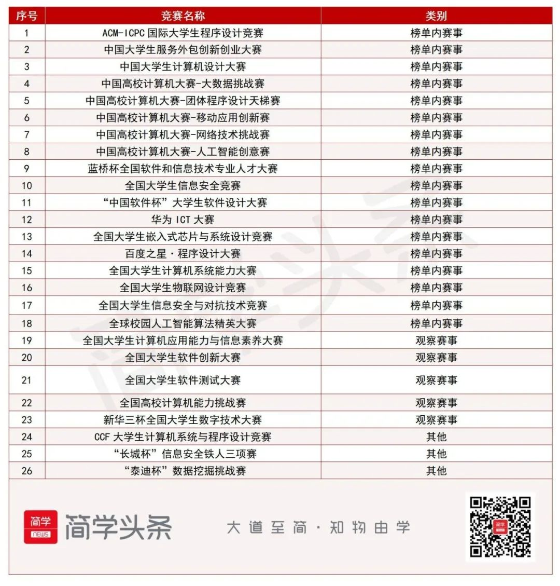

---
head:
  - - meta
    - name: og:description
      content: 软件新生经验分享，帮助你快速了解软件学院学习、竞赛等方面的小经验。
  - - meta
    - name: keywords
      content: 软件工程 本科 学习经验
---

# 本科新生经验分享（学习、竞赛、入党等）

`作者：aomenfage`

> 比起随大流，更难能可贵的是想清楚自己为什么要做这件事。

## 课程学习

>学生的核心任务，一切都围绕这一核心任务。

### 合格的软件毕业生标准

- 熟练掌握“计算机基础四科”：计算机网络、操作系统、数据结构和计算机组成原理的知识。
- 熟练掌握至少一门高级语言：Java、C++（其他语言不推荐作为主语言）
- 算法能力强，在 Leetcode 上拥有足够的做题数量，有算法比赛经历更佳。（算法能力是衡量编程能力的金标准）
- 拥有足够的**项目经验**。如：科研项目经历、实习项目、开源项目复现等。
- 拥有清晰的职业规划，并熟悉本职业要学习的各项技术栈。例：后端开发掌握数据库、中间件、后端框架等相关知识；测试掌握测试工具、测试方法等。

### 学习方法误区

很多同学的学习方法有很大问题。

- 没有经过思考的刷题、刷网课。
- 无论什么知识都通篇学习，不会捡取对自己更有用的内容。
- 重理论，而轻实践。

接下来将向大家分享我所认为的正确的学习方法。

### 基础必修课程

全校开设的必修课程，如微积分、英语、线代、大物等。

- 奠定专业基础的课程，一般不涉及专业内容。
- 要多刷题，刷题是高分的根本保证。
- 甭管老师讲的有多不好懂，课一定要去。机遇全在不经意间流逝。——翘课只有零次和无数次。
- 推荐结合网课。（推荐著名考研课程、或网络推荐的名课。网课参考书书一定要和自己一致或相近）

### 全校任选课程

全校开设的选修课程，如交响乐欣赏、古代汉语入门等。

- 质量参差不齐，口碑很重要。
- 应当以兴趣为导向，扩展眼界为主要目的。
- 🌟该类课程不能帮助你增加专业能力。

### “408”专业课程

学院开设的考研计算机专业课科目“408”，包括计算机网络、操作系统、数据结构、计算机组成原理。

- 课程体系性强，教学内容全国统一，课程资料很好找。
- 课程内容较多较难，需要投入更多的精力学习。
- 计算机最基础的课程，即使现在不学，未来考研或从事相关岗位也要学。
- 考试内容大多取自考研题目。
- 推荐学习资料：王道考研（包含书籍、b站免费网课）

### 其他专业理论课程

学院开设的除“408”以外的计算机专业理论课程，如算法设计与实现、面向对象程序设计、机器学习等。

- 课程没有统一内容，因此复习应当以老师讲授内容为准。
- 高分关键1：高标准完成所有作业：文档类作业注意格式美观，内容充实详细；编程类作业功能丰富，界面美观，工程结构丰富合理，多使用设计模式、中间件、新技术等。
- 高分关键2：上课多回答问题，下课多向老师请教问题，增加自己的存在感。
- 老师所讲的内容往往比较基础，有能力的同学可以自行查找材料扩展。

### 专业实训课程

学院开设的专业实训类课程，包括各种“小学期”，学期中的实训课程等。

- 一定要积极当组长！
- 自学过程切记不要“大水漫灌”，要有针对性的进行学习。例：我不会Python，并不是找个网课从头看到尾，也不是抱着啃书，而是哪个方法不会找哪个（但仅限拥有一定编程经验的人如此学）。
- 做好组长：学会团队管理方法，会分解任务、分配任务，要**赏罚分明**（给每个人一样的分数不会给你带来好人缘，要给他值得的分数）。
- 做好组员：给自己要完成的任务限时（如1天写完一个接口），定期向组长汇报自己的进度，高质量完成。
- 高分关键1：高标准完成所有作业：文档类作业注意格式美观，内容充实详细；编程类作业功能丰富，界面美观，工程结构丰富合理，多使用设计模式、中间件、新技术等。
- 高分关键2：注重答辩。PPT清晰美观，答辩稿详实丰富，回答老师询问的问题灵活自如。

## 学科竞赛

> 多多尝试，大学生最好获得的项目经验。

### 适合软件专业的竞赛-计算机类

**表 1 2023年列入计算机类竞赛研究报告的竞赛项目清单**

### 适合软件专业的竞赛-创新创业类

- 中国国际“互联网+”大学生创新创业大赛
- “挑战杯”全国大学生课外学术科技作品竞赛
- “挑战杯”中国大学生创业计划大赛
- 全国大学生创新创业训练计划

### 适合软件专业的竞赛-基础学科类

- 全国大学生数学建模竞赛
- “21世纪杯”全国英语演讲比赛

### 更多比赛

链接：2023年全国大学生可以参加的比赛目录（转载）
http://localhost:5173/practice/other/competition-list.html

### 竞赛时间

查询各个竞赛的官网，或关注比赛的公众号。

这里推荐一下学校科协公众号的常驻栏目“竞赛早报”。

### 竞赛经验

- 指导老师可以通过辅导员、学长学姐、或在上课时进行联系。选择哪位老师可以通过曾经参与过竞赛的学长学姐获取经验。
- 竞赛PPT、视频等展示材料比起代码本身重要得多。
- 创意比完成度、工作量重要得多（服务外包等提出明确需求的比赛除外）。
- 长线的比赛一定要尽早完成，拖泥带水就会变成“ddl驱动”。

## 科研

>科研不只是写论文。计算机科研也不只是人工智能。

### 科研项目种类

- 导师申请的国家重点研发计划、国家自然科学基金等

该类科研项目成果内容较为繁杂，往往可能包含产品、论文、文档等。

- 学术论文

导师带头或学生自主研究的学术论文。一般为“研究型”而非“工程型”。

- 导师的横向课题

横向课题为导师通过企业、政府等单位所申请的课题，一般为产品，有可能会有专利或者论文。

### 软件学院科研方向

> 可以通过搜索软件学院官网的教师个人页，查看老师近期发表的论文或项目确定其研究方向

- 神经网络理论及应用（计算机视觉、自然语言处理、时序预测等）
- 图神经网络、知识图谱、数据挖掘理论及应用
- 计算机网络、通信（边缘计算、联邦计算、智慧通信、移动计算等）
- 人机交互、虚拟现实、计算机图形学等
- 智慧交通工程

### 科研经验

- 指导老师可以通过辅导员、学长学姐、或在上课时进行联系。选择哪位老师可以通过曾经参与过科研的学长学姐、本学院研究生获取经验。
- 科研内容可大致分为“工程”和“研究”两种。工程类需要掌握一定的软件工程能力（高级语言、前后端框架等）；研究类需要掌握仿真、学术写作以及对应领域的知识。
- 导师对于你能否做出科研起决定性作用。因此，勤找老师很关键。
- 勤与同实验室的师兄师姐联系。单打独斗是搞科研的大忌（除非你特别强大）。

## 学生工作

>好像很辛苦，但有没有辛苦对地方呢。

::: tip 解释一个经典问题：学生工作究竟有没有用？

从初衷来看，学生工作，也就是学生自治组织，和兴趣社团一样，是一群怀着提升学生团体整体力量愿望的有志青年所组成的团体，而他们的“兴趣”就是 **“社会服务”** ——帮助同学们变得更强，更有力量。网络有一句著名论断：放弃助人情节，尊重他人命运。但有这么一群人，他们并不关心学生工作对他们“有没有用”，而更关心学生工作对同学们“有没有用”。

当然，以“社会服务”作为兴趣的同学只是一部分。另一部分同学也是希望通过基层工作提升自己的**领导力**。领导力，也就是组织管理能力，并不是天生的，而一定是通过参与组织工作，积累经验、逐渐体悟的。因此，在国企、事业单位及机关单位招聘时也比较看重这方面的经历，在校招面试时会有所体现。当然民营企业并不太看重，因为民营企业比起招募领导人员，更愿意招募精进于技术的人员。

除此以外，也有一部分人可以通过学生工作扩大自己的影响力和社交圈，

从学生团体的整体发展来看，学生职能社团有其存在的必要性。学生单打独斗的力量是无法获取足够数量的资源的，同时一个人思想的局限性很大程度上限制了个人的发展，这就需要集体力量的支持。而维持起这一集体力量，就是自治组织的作用。

:::

### 学生工作种类

1. 班级委员、团支部委员、党支部委员
学生群体最基层的组织单位，通过班会、团员大会、党员大会选举产生，是与同学接触最密切的单位，负责同学们的组织管理、活动开展等工作。

2. 学生会、研究生会
学生自治组织，会长由学生代表大会选举产生，其他会员由主席进行招募。创建初衷是学生进行自我管理自我学习的组织。一般有文艺部、体育部、权益部、宣传部等部门。

3. 科学技术协会（简称“科协”）
学生自治组织，会长由上级团委酝酿产生，其他会员由主席进行招募。分担一部分学生会的作用，负责在学生群体中宣传科学技术知识，组织专业技术与学术活动等职责。一般有科普部、竞赛部等部门。

4. 特色理论研究会（简称“特研会”）
学生自治组织，会长由上级团委酝酿产生，其他会员由主席进行招募。分担一部分学生会的作用，负责在学生群体中宣传中国特色主义理论、推进校园精神文明建设等职责。一般有宣传部、办公室等。

5. 团委
团支部的上级领导单位，由团员组成，负责团的组织建设、团员教育等工作。一般有宣传部、办公室、组织部等。

6. 青年志愿者团
学生自治组织，会长由上级团委酝酿产生，其他会员由主席进行招募。分担一部分学生会的作用，负责在学生群体中组织志愿者活动，宣传志愿精神等职责。一般有工作部、办公室、宣传部等。

## 入党

>同学们挤着要进，却不明白为何要进

### 几种常见且错误的入党动机

| 入党动机 | 具体表现 | 错误等级 |
| :--- | :--- | :--- |
| 报恩式入党 | 党建设了我的家乡、党帮助了我的家人... | 🌟 |
| 跟风式入党 | 别人入了我也入、有这个机会投投试试... | 🌟🌟 |
| 投机式入党 | 党很好所以想入、党员团体优秀所以我想加入... | 🌟🌟🌟 |
| 争优式入党 | 党员身份能体现自身的优秀... | 🌟🌟🌟🌟 |
| 利己式入党 | 考公有党员限定岗位、党员在单位更好升职... | 🌟🌟🌟🌟🌟 |

### 唯一正确的入党动机

**全心全意为人民服务，为共产主义事业奋斗终身**
::: tip 你真的理解这句话吗？

**1. 全心全意为人民服务**

- 我是否服务过群众（如担任学生工作）？
- 我是否愿意全心全意为人民服务？
- 我是否愿意为人民群众献出一切？

**2. 为共产主义事业奋斗终身**

- 共产主义是什么？
- 为什么共产主义好？
- 为什么共产主义一定能够实现？
- 共产主义究竟是不是我的信仰？

:::

### 入党流程

**1. 入党申请人**

在向党支部提交**入党申请书**并审阅后，成为入党申请人。

**2. 入党积极分子**

团员经过**团组织推优**（或群众通过党员介绍）后，由所在党支部委员会讨论通过后成为入党积极分子。

**3. 发展对象**

入党积极分子在一年以上的**培养考察**后，党支部酝酿人选，经过**党内外意见征集**，所在党支部委员会讨论通过后成为发展对象。

**4. 中共预备党员**

发展对象家庭**政治审查**无明显问题，党支部酝酿人选，经过**党内外意见征集**、**党委预审**等过程，再经过所在党支部党员大会讨论通过并形成决议后，成为预备党员。

**4. 中共党员**

中共预备党员在经过一年的考察期后若无明显问题，在递交**转正申请书**，经过所在党支部党员大会讨论通过并形成决议后，即可成为中共正式党员。

### 入党的切实行动

- 关注时事政治，了解世界局势，对社会热点新闻有正确且深刻的看法。
- 注重理论学习，大量阅读党的理论书籍原作或解析，擅长理论联系实际，经常使用党的理论知识解释社会问题。
- 如实向党组织汇报自己的思想，不抄袭不剽窃。积极完成党组织下达的任务。
- 热爱服务群众，经常服务群众，并将服务人民作为自己的责任而非累赘或跳板。
- 拥有共产主义的远大理想，明确实现共产主义的理论逻辑。

### 建议阅读的书籍

**基础篇**

>这里推荐的书籍可以让你全面了解中国共产党，为入党必备书籍。

- 《中国共产党章程》 人民出版社

中国共产党的根本大法，重要性不必多说。

- 《入党教材》 党建读物出版社

中央组织部指定的入党积极分子和发展对象培训教材。

- 《中国共产党简史》 人民出版社，中共党史出版社

中央宣传部组织编写的中国共产党百年历史记录书籍，为学习党史的权威读本。

- 《马克思主义基本原理》 、《毛泽东思想和中国特色理论体系概论》、《习近平新时代中国特色社会主义思想概论》 高等教育出版社

大学政治课读本，学习党的理论最简洁、全面、清晰易懂的书籍。

**高级篇**

>这里推荐的书籍并不能帮助你更容易通过党课考试，而是帮助你建立信仰，提升思想水平。如果你只是想读“更有用的书”，还请跳过。

- 《苏共亡党二十年祭》 江西高校出版社 黄苇町著

总结苏联解体的经验教训，以“若不心向人民，必被人民抛弃”作为主题，为群众路线教育的极好书籍。

- 《苦难辉煌》 作家出版社 金一南著

中共早期党史的研究类书籍，扩展讲述党史的历史细节，帮助读者了解中国共产党如何从苦难中走向辉煌。

- 《毛泽东选集》 ——《矛盾论》、《实践论》

毛泽东用朴实且深刻的语言，阐述“矛盾论”、“认识论”这几个马克思主义哲学的根本论题。

## 对大学的个人看法

> 私货环节，都是个人的主观看法，大家兼听则明

- 千万不要让自己陷入“工匠精神”的思维定式。社会分工必然导致阶级分化。自由而全面的发展才是破解“阶级怪圈”的根本路径。
- 一定要从事政治工作（如学生工作、社会组织工作、公司领导工作等），无论是学生时期还是将来，不要做一辈子“打工人”。
- 当“社恐”只会害了你，机会只会留给“社牛”。——人的定义是“一切社会关系的总和”，人是永远脱离不了“关系”的，拥有越多的“关系”才会拥有越多的机会。
- 一张好嘴远比一个好技术重要得多，而这往往被中国学生忽略。
- “报团取暖，共同进步”，形成一个学习团体，比单打独斗更容易成功。
