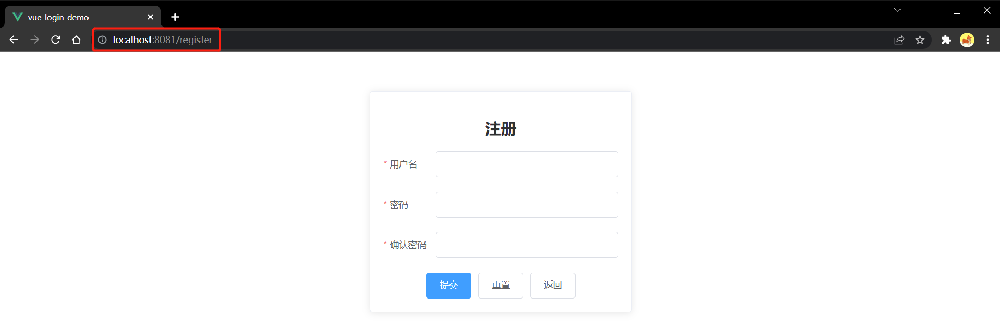
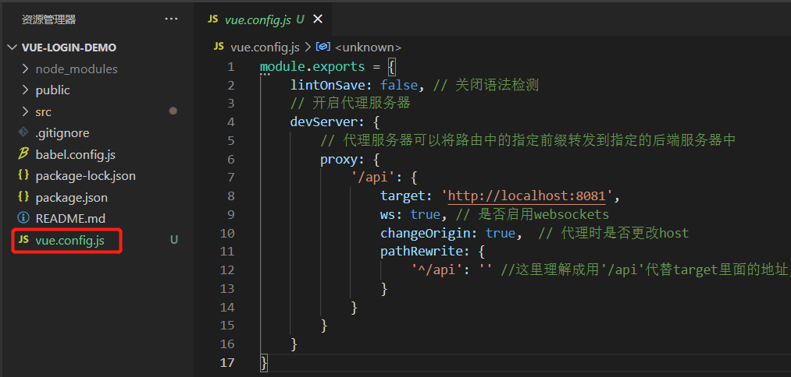
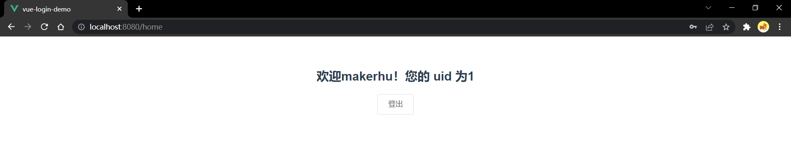

---
head:
  - - meta
    - name: og:description
      content: 本文面向小白，用 Vue 实现了登录注册的功能，并能够与 SpringBoot 后端进行数据交互。
  - - meta
    - name: keywords
      content: Vue 登录 注册 前后端分离
---

# Vue 实现登录注册功能（前后端分离完整案例）

`作者：MakerHu`

> 本文面向小白，用 Vue 实现了登录注册的功能，并能够与 SpringBoot 后端进行数据交互。麻雀虽小，五脏俱全，本项目用到了 vue-router、axios、Element UI、代理服务器、导航守卫等技术或工具，与本站的另一篇文章[快速上手SpringBoot项目（登录注册保姆级教程）](/practice/java/springboot-login-demo) 共同组成了前后端分离项目的整体，适合小白上手 Vue + SpringBoot + Mysql 的项目开发。

文章由作者本人转载至本站，原地址：[Vue 实现登录注册功能（前后端分离完整案例） | MakerHu 的博客](https://www.makerhu.com/posts/78e35d03/)

后端教程：[快速上手SpringBoot项目（登录注册保姆级教程）](/practice/java/springboot-login-demo)

项目演示：


**说明：**

- 本文中后半部分涉及到与后端的交互，需要先根据本人的另一个教程：[快速上手SpringBoot项目（登录注册保姆级教程）](/practice/java/springboot-login-demo) 在本地运行起后端后才能测试，这个 Vue 前端项目是与前面这个教程的 SpringBoot 项目配套的前后端项目，因此**建议先看完后端的文章再看此文章**，当然如果只是要看前端登录注册页面的代码，也是没有问题的，只要忽略目录中**前后端数据交互**之后的内容就行了。
- 本文中🛠标志后面跟着的命令都是要在命令行窗口运行的命令，命令窗口用 cmd 就行了
- 文章最后有项目（前端和后端）的**源代码**哦

## 环境准备

- Node.js

  Node 版本要求：Vue CLI 4.x 需要 [Node.js](https://nodejs.org/) v8.9 或更高版本 (推荐 v10 以上)。

### 安装 Vue 脚手架

**官网地址：**[安装 | Vue CLI (vuejs.org)](https://cli.vuejs.org/zh/guide/installation.html)

- 卸载旧版本的脚手架（之前安装过旧版本的脚手架才需要执行）：在任意地方打开 cmd 运行命令🛠`npm uninstall vue-cli -g`

  > 关于旧版本
  >
  > Vue CLI 的包名称由 `vue-cli` 改成了 `@vue/cli`。 如果你已经全局安装了旧版本的 `vue-cli` (1.x 或 2.x)，你需要先通过 `npm uninstall vue-cli -g` 或 `yarn global remove vue-cli` 卸载它。—— [Vue 官网](https://cli.vuejs.org/zh/guide/installation.html#:~:text=%E5%85%B3%E4%BA%8E%E6%97%A7%E7%89%88%E6%9C%AC,%E5%8D%B8%E8%BD%BD%E5%AE%83%E3%80%82)

- 安装新版本的脚手架：🛠`npm install -g @vue/cli`

- 检查脚手架是否安装成功（能看到版本号说明安装成功）：🛠`vue --version`

  

- 如果已经安装过新版的脚手架`@vue/cli`可进行全局升级：🛠`npm update -g @vue/cli`

## 创建项目

- 进入你要创建 Vue 项目的文件夹

  

- 在 cmd 命令框中输入以下命令来创建一个新项目
  🛠`vue create vue-login-demo`

  - 其中`vue-login-demo`为项目名，可根据需要修改

  - 选择 [Vue 2] 回车，因为是默认选项，可以直接回车

    

  - 成功提示

    

- 试运行新创建的初始化项目

  - 首先进入项目目录：🛠`cd vue-login-demo`
  - 运行项目：🛠`npm run serve`

  

- 在浏览器地址栏中输入`http://localhost:8080/`回车，即可看到创建的初始化项目的效果，此页面是脚手架中写的一个HelloWorld示例页面，之后可以删了换成你写的页面。

  

## Vue 项目的一些基本命令

- 启动项目：在 Vue 项目的根目录中打开 cmd ，运行命令🛠`npm run serve`
- 停止项目：在运行 Vue 项目的命令行窗口按快捷键 ctrl + C
- 安装插件：在 Vue 项目的根目录中打开 cmd，运行命令🛠`npm install xxx`

## 项目文件结构

> 创建完项目后，为了帮助未来的开发，我们首先要熟悉一下刚刚通过 Vue 脚手架创建的项目中的每个文件的作用是什么

### 初始项目结构


- **public 文件夹**

  - **favicon.ico：** 页面的图标

  - **index.html：** 页面的总入口，Vue项目一般是一个单页应用，也就是只有一个页面，我们看到的页面变化其实都是在这个页面中对某个组件进行局部刷新，这个页面中存在一个 id 为 app 的 div 标签，这个标签就是 App.vue 这个根组件的挂载点，可以简单理解为框架会把 App.vue 这个根节点放到 index.html 中的`<div id="app"></div>`这个位置

    ```html
    <!DOCTYPE html>
    <html lang="">
      <head>
        <meta charset="utf-8">
        <meta http-equiv="X-UA-Compatible" content="IE=edge">
        <meta name="viewport" content="width=device-width,initial-scale=1.0">
        <link rel="icon" href="<%= BASE_URL %>favicon.ico">
        <title><%= htmlWebpackPlugin.options.title %></title>
      </head>
      <body>
        <noscript>
          <strong>We're sorry but <%= htmlWebpackPlugin.options.title %> doesn't work properly without JavaScript enabled. Please enable it to continue.</strong>
        </noscript>
        <div id="app"></div>
        <!-- built files will be auto injected -->
      </body>
    </html>
    ```

- **src 文件夹**

  - **assets 文件夹：** 资源文件，如存放一些图片 css 文件等
  - **components 文件夹：** 项目的公共组件，就是一些整个项目都有可能用到的组件，如一些公用的弹窗、输入框、按钮等

- **App.vue：** 项目的根组件，其他所有组件都包含在这个组件里，作为它的子组件或孙子组件

- **main.js：** 整个项目的入口文件，在运行`npm run serve`命令时首先就运行了 main.js 这个文件，主要用来创建 Vue 实例，并作为桥梁将 App.vue 组件挂载到 index.html 中，此文件还负责全局引入一些插件并安装插件等功能，如引入 Element UI

  ```javascript
  import Vue from 'vue'
  import App from './App.vue'
  
  // 关闭 Vue 的生产提示
  Vue.config.productionTip = false
  
  // 创建 Vue 实例对象
  new Vue({
    render: h => h(App),  // render 函数将帮助解析模板，传入的参数 h 为一个函数，该函数可用来解析 App 这个组件
  }).$mount('#app') // 将 App.vue 组件挂载到 index.html 中的 id 为 app 的 div 标签上
  ```

### 补充项目结构

这里列出一些在本项目写完后会多出来的一些文件目录，简单介绍，在这里看不懂正常，把整篇教程看完后就能看懂了。


- **src 文件夹**

  - **views 文件夹：** 用来存放页面组件，主要是一些页面路由跳转要刷新的那些最大的组件
  - **router 文件夹：** 用来配置项目的路由

- **vue.config.js 文件：** 配置文件，如配置代理服务器等

  

## 引入 Element UI

> Element UI 是由饿了么公司开发的一套桌面组件库，像一些表格、按钮、时间选择器等都可以直接使用，且简洁美观

官网：[组件 | Element](https://element.eleme.cn/#/zh-CN/component/installation)

- 安装 Element UI：在项目根目录中打开cmd，输入🛠`npm i element-ui -S` 没有报error就说明安装成功

- 引入 Element，在`src/main.js`中添加三行代码（下方中注释为Element 1、2、3的三行）

  ```js
  import Vue from 'vue'
  import App from './App.vue'
  import ElementUI from 'element-ui';	// Element 1
  import 'element-ui/lib/theme-chalk/index.css'; // Element 2
  
  // 关闭 Vue 的生产提示
  Vue.config.productionTip = false
  
  // 使用插件
  Vue.use(ElementUI); // Element 3
  
  // 创建 Vue 实例对象
  new Vue({
    render: h => h(App),
  }).$mount('#app')
  ```

- 在 `src/App.vue` 中写个 Element 的按钮组件测试一下`<el-button>test</el-button>`

  

  

## 编写登录组件

- 在项目`src/views`文件夹下创建`login`文件夹并创建`Login.vue`组件

  

- 在 App.vue 中注册 Login.vue 组件，把没用的 HelloWorld 都删了（红框部分）添加绿框部分的代码

  

  **修改后的App.vue**

  ```vue
  <template>
    <div id="app">
      <Login></Login>
    </div>
  </template>
  
  <script>
  import Login from './views/login/Login.vue'
  
  export default {
    name: 'App',
    components: {
      Login
    }
  }
  </script>
  
  <style>
  #app {
    font-family: Avenir, Helvetica, Arial, sans-serif;
    -webkit-font-smoothing: antialiased;
    -moz-osx-font-smoothing: grayscale;
    text-align: center;
    color: #2c3e50;
    margin-top: 60px;
  }
  </style>
  ```

- 测试组件是否正常显示

  先在 Login.vue 组件中写个最简单的文本显示

  **Login.vue：**

  ```vue
  <template>
    <div>
        <h1>Login test</h1>
    </div>
  </template>
  
  <script>
  export default {
  
  }
  </script>
  
  <style scoped>
  
  </style>
  ```

- 查看页面是否变更，如果正常显示 Login.vue 里的内容则说明 App.vue 中 Login 组件注册成功

  

- 完善 Login.vue 组件的页面、样式和一些基本逻辑。到 Element UI 中找到表单组件，这里使用的是自定义校验规则这个例子[Element UI 表单](https://element.eleme.cn/#/zh-CN/component/form)，将该例子进行修改成为登录组件

  **修改后的 Login.vue：**

  ```vue
  <template>
    <div>
      <el-card class="box-card">
        <h2>登录</h2>
        <el-form
          :model="ruleForm"
          status-icon
          :rules="rules"
          ref="ruleForm"
          label-position="left"
          label-width="70px"
          class="login-from"
        >
          <el-form-item label="用户名" prop="uname">
            <el-input v-model="ruleForm.uname"></el-input>
          </el-form-item>
          <el-form-item label="密码" prop="password">
            <el-input
              type="password"
              v-model="ruleForm.password"
              autocomplete="off"
            ></el-input>
          </el-form-item>
        </el-form>
        <div class="btnGroup">
          <el-button type="primary" @click="submitForm('ruleForm')"
            >登录</el-button
          >
          <el-button @click="resetForm('ruleForm')">重置</el-button>
          <router-link to="/register">
            <el-button style="margin-left:10px">注册</el-button>
          </router-link>
        </div>
      </el-card>
    </div>
  </template>
  
  <script>
  export default {
    data() {
      return {
        ruleForm: {
          uname: "",
          password: "",
        },
        rules: {
          uname: [
            { required: true, message: "用户名不能为空！", trigger: "blur" },
          ],
          password: [
            { required: true, message: "密码不能为空！", trigger: "blur" },
          ],
        },
      };
    },
    methods: {
      submitForm(formName) {
        this.$refs[formName].validate((valid) => {
          if (valid) {
            alert("submit!");
          } else {
            console.log("error submit!!");
            return false;
          }
        });
      },
      resetForm(formName) {
        this.$refs[formName].resetFields();
      },
    },
  };
  </script>
  
  <style scoped>
  .box-card {
    margin: auto auto;
    width: 400px;
  }
  .login-from {
    margin: auto auto;
  }
  </style>
  ```

  显示效果：

  

## 配置路由

> 在写网站应用的过程中，离不开一个功能，就是页面的跳转，而在 Vue 这种单页应用中，一个网站就只有一个页面，我们看到所谓页面的“跳转”其实只是同一个页面中的局部组件的刷新，而路由的指的是浏览器地址栏中的路径与组件有着一一对应的关系，当输入指定的地址时，页面中的某个区域的组件会替换成该地址对应的组件。

官网：[安装 | Vue Router (vuejs.org)](https://router.vuejs.org/zh/installation.html)

- 安装路由插件

  在项目根目录中打开cmd，输入🛠`npm install vue-router`

- 在`src`下创建 `router` 文件夹，并在`router`文件夹下创建`index.js`文件，该问价作为整个项目路由的配置文件

  

- `src/router/index.js`文件内容，这里实现的是路径'/'，'/login'都跳转到 Login.vue 组件

  ```js
  // 此文件专门负责项目的路由
  
  import VueRouter from "vue-router"
  
  // 引入组件
  import Login from '../views/login/Login'
  
  // 创建并暴露一个路由器
  export default new VueRouter({
      mode: 'history',    // 路由模式，该模式不会在地址中显示井号#
      routes: [
          {
              path: '/',          // 路径
              redirect: '/login'  // 重定向
          },
          {
              path: '/login',     // 路径
              component: Login    // 跳转到的组件
          }
      ]
  })
  ```

- 引入路由插件，在`src/main.js`中添加三行代码（下方中注释为 路由 1、2、3、4 的四行）

  ```js
  import Vue from 'vue'
  import App from './App.vue'
  import ElementUI from 'element-ui';
  import 'element-ui/lib/theme-chalk/index.css';
  import VueRouter from 'vue-router' // 路由 1
  import router from './router' // 路由 2
  
  // 关闭 Vue 的生产提示
  Vue.config.productionTip = false
  
  // 使用插件
  Vue.use(ElementUI)
  Vue.use(VueRouter) // 路由 3
  
  // 创建 Vue 实例对象
  new Vue({
    render: h => h(App),
    router // 路由 4
  }).$mount('#app')
  ```

- 在`src/App.vue`中将`<router-view />`放到路由跳转时，页面需要局部刷新的部分，并把刚刚在`App.vue`中写死的组件给删了（删除红色，添加绿色框中的内容）

  

  修改后的`App.vue`:

  ```vue
  <template>
    <div id="app">
      <router-view />
    </div>
  </template>
  
  <script>
  export default {
    name: 'App',
    components: {
    }
  }
  </script>
  
  <style>
  #app {
    font-family: Avenir, Helvetica, Arial, sans-serif;
    -webkit-font-smoothing: antialiased;
    -moz-osx-font-smoothing: grayscale;
    text-align: center;
    color: #2c3e50;
    margin-top: 60px;
  }
  </style>
  ```

- 检查地址栏跳转是否正常

  

  

## 编写注册组件

- 在项目`src/views`文件夹下创建`register`文件夹并创建`Register.vue`组件

  

- **Register.vue 组件代码**

  ```vue
  <template>
    <div>
      <el-card class="box-card">
        <h2>注册</h2>
        <el-form
          :model="ruleForm"
          status-icon
          :rules="rules"
          ref="ruleForm"
          label-position="left"
          label-width="80px"
          class="demo-ruleForm"
        >
          <el-form-item label="用户名" prop="uname">
            <el-input v-model="ruleForm.uname"></el-input>
          </el-form-item>
          <el-form-item label="密码" prop="pass">
            <el-input
              type="password"
              v-model="ruleForm.pass"
              autocomplete="off"
            ></el-input>
          </el-form-item>
          <el-form-item label="确认密码" prop="password">
            <el-input
              type="password"
              v-model="ruleForm.password"
              autocomplete="off"
            ></el-input>
          </el-form-item>
        </el-form>
        <div class="btnGroup">
          <el-button type="primary" @click="submitForm('ruleForm')"
            >提交</el-button
          >
          <el-button @click="resetForm('ruleForm')">重置</el-button>
          <el-button @click="goBack">返回</el-button>
        </div>
      </el-card>
    </div>
  </template>
  
  <script>
  export default {
    data() {
      var validatePass = (rule, value, callback) => {
        if (value === "") {
          callback(new Error("请输入密码"));
        } else {
          if (this.ruleForm.checkPass !== "") {
            this.$refs.ruleForm.validateField("checkPass");
          }
          callback();
        }
      };
      var validatePass2 = (rule, value, callback) => {
        if (value === "") {
          callback(new Error("请再次输入密码"));
        } else if (value !== this.ruleForm.pass) {
          callback(new Error("两次输入密码不一致!"));
        } else {
          callback();
        }
      };
      return {
        ruleForm: {
          uname: "",
          pass: "",
          password: "",
        },
        rules: {
          uname: [
            { required: true, message: "用户名不能为空！", trigger: "blur" },
          ],
          pass: [{ required: true, validator: validatePass, trigger: "blur" }],
          password: [
            { required: true, validator: validatePass2, trigger: "blur" },
          ],
        },
      };
    },
    methods: {
      submitForm(formName) {
        this.$refs[formName].validate((valid) => {
          if (valid) {
            alert("submit!");
          } else {
            console.log("error submit!!");
            return false;
          }
        });
      },
      resetForm(formName) {
        this.$refs[formName].resetFields();
      },
      goBack() {
        this.$router.go(-1);
      },
    },
  };
  </script>
  
  <style scoped>
  .box-card {
    margin: auto auto;
    width: 400px;
  }
  .login-from {
    margin: auto auto;
  }
  </style>
  ```

- 配置注册页面路由。在`src/router/index.js`中添加红框中的代码

  

  ```js
  // 此文件专门负责项目的路由
  
  import VueRouter from "vue-router"
  
  // 引入组件
  import Login from '../views/login/Login'
  import Register from '../views/register/Register'
  
  // 创建并暴露一个路由器
  export default new VueRouter({
      mode: 'history',    // 路由模式，该模式不会在地址中显示井号#
      routes: [
          {
              path: '/',          // 路径
              redirect: '/login'  // 重定向
          },
          {
              path: '/login',     // 路径
              component: Login    // 跳转到的组件
          },
          {
              path: '/register',     // 路径
              component: Register    // 跳转到的组件
          }
      ]
  })
  ```

- 测试页面与路由。在地址栏中输入`/register`，点击返回按钮正常跳转

  

## 编写首页组件

> 本教程的首页只是为了展示后端返回的数据，因此只实现了将数据显示到页面上，稍微有那么一丝丝简陋，见谅

- 在项目`src/views`文件夹下创建`home`文件夹并创建`Home.vue`组件

  

- **Home.vue 组件代码**

  ```vue
  <template>
    <div>
      <h2>欢迎{{ user.uname }}！您的 uid 为{{ user.uid }}</h2>
      <router-link to="/login">
        <el-button> 登出 </el-button>
      </router-link>
    </div>
  </template>
  
  <script>
  export default {
    data() {
      return {
        user: {
          uname: "",
          uid: null,
        },
      };
    },
  };
  </script>
  
  <style scoped>
  </style>
  ```

- 配置首页路由。在`src/router/index.js`中添加红框中的代码

  

  ```js
  // 此文件专门负责项目的路由
  
  import VueRouter from "vue-router"
  
  // 引入组件
  import Login from '../views/login/Login'
  import Register from '../views/register/Register'
  import Home from '../views/home/Home'
  
  // 创建并暴露一个路由器
  export default new VueRouter({
      mode: 'history',    // 路由模式，该模式不会在地址中显示井号#
      routes: [
          {
              path: '/',          // 路径
              redirect: '/login'  // 重定向
          },
          {
              path: '/login',     // 路径
              component: Login    // 跳转到的组件
          },
          {
              path: '/register',     // 路径
              component: Register    // 跳转到的组件
          },
          {
              path: '/home',     // 路径
              component: Home    // 跳转到的组件
          }
      ]
  })
  ```

- 测试页面与路由。在地址栏中输入`/home`，点击登出按钮，正常跳转

  

**至此所有的本 demo 的所有页面都写完了，一些简单的前端跳转逻辑也已完成，接下来就需要与后端进行交互，实现我们的登录注册功能。**

## 前后端数据交互

> 在开始前后端数据交互的功能开发之前，我们应该得先有个后端，并且这个后端已经写好了登录注册的相关功能接口，这样我们就可以直接请求接口数据了。别担心，后端的项目我早已准备好了🎉
> [快速上手SpringBoot项目（登录注册保姆级教程） | www.makerhu.com/posts/5b2ca0db/](https://www.makerhu.com/posts/5b2ca0db/)  
> 这个教程里详细介绍了如何开发一个 SpringBoot 后端的登陆注册小项目，与这个项目是配套的，教程的最后也附上了项目的源代码，可以直接克隆下来配置一下数据库就能运行了，如何配置数据库教程里也有详细的介绍。以下的数据请求功能我都是直接请求这个后端项目的接口，请求地址是 localhost:8081 在此就不赘述如何在本地启动后端项目了，详见上方的教程链接。

**注：在写涉及到与后端交互的功能时一定记得要先把后端启动起来，否则是找不到后端的，一般是在前端开发全程都运行着后端的。**

### 后端接口说明

由于本项目需要向后端项目请求数据，因此我们需要先知道后端都实现了什么接口。在后端项目中一共就实现了两个接口，分别是登录接口和注册接口，以下是接口说明（可以先跳过，等到实现登录注册功能时再回来看）：

- **登录接口**

  - 请求地址：http://localhost:8081/user/login

  - 请求方法：post

  - 请求参数：

    - uname：用户名，字符串类型
    - password：密码，字符串类型

    请求示例：

    ```json
    params: {
    	uname: 'makerhu',
    	password: '123',
    }
    ```

  - 成功响应编码

    ```json
    {
        "code": "0",
        "msg": "登录成功！",
        "data": {
            "uid": 1,
            "uname": "makerhu",
            "password": ""
        }
    }
    ```

  - 失败响应编码

    ```json
    {
        "code": "123",
        "msg": "账号或密码错误！",
        "data": null
    }
    ```

- **注册接口**

  - 请求地址：http://localhost:8081/user/register

  - 请求方法：post

  - 请求参数：

    - json 对象，包含用户名 uname 和密码 password

    请求示例：

    ```json
    data: {
        uname: 'makerhu',
        password: '123'
    }
    ```

  - 成功响应编码

    ```json
    {
        "code": "0",
        "msg": "注册成功！",
        "data": {
            "uid": 7,
            "uname": "user6",
            "password": ""
        }
    }
    ```

  - 失败响应编码

    ```json
    {
        "code": "456",
        "msg": "用户名已存在！",
        "data": null
    }
    ```

### 安装 axios

> axios 简单理解就是用来帮助我们实现网络数据请求的一个插件，我们可以通过它与后端进行数据交互

axios 中文文档：[axios中文文档|axios中文网 | axios (axios-js.com)](http://www.axios-js.com/zh-cn/docs/#axios-API)

- **安装 axios**

  在项目根目录中打开 cmd，输入🛠`npm install axios`，等待结束后没有显示 error 关键字即成功

- **在项目中引入使用 axios**，在`src/main.js`中添加红色框中的三行代码

  

  修改后的 `main.js` 文件：

  ```js
  import Vue from 'vue'
  import App from './App.vue'
  import ElementUI from 'element-ui';
  import 'element-ui/lib/theme-chalk/index.css';
  import VueRouter from 'vue-router'
  import router from './router'
  import axios from 'axios'
  import VueAxios from 'vue-axios'
  
  // 关闭 Vue 的生产提示
  Vue.config.productionTip = false
  
  // 使用插件
  Vue.use(ElementUI) // element ui 插件
  Vue.use(VueRouter) // 路由插件
  Vue.use(VueAxios, axios) // 使用 axios 插件
  
  // 创建 Vue 实例对象
  new Vue({
    render: h => h(App),  // render 函数将帮助解析模板，传入的参数 h 为一个函数，该函数可用来解析 App 这个组件
    router
  }).$mount('#app') // 将 App.vue 组件挂载到 index.html 中的 id 为 app 的 div 标签上
  ```

  现在我们就能在 Vue 实例中通过`this.axios`调用了。

- **如何使用 axios**

  在 vue 的方法中我们可以通过下面例子中的方式使用 axios, 配合接口说明就能与后端进行数据交互了，具体用法见官方文档

  ```js
  this.axios.post({
    method: 'post',		// 请求方法
    url: 'http://localhost:8081/user/login',	// 请求地址
    data: {	// 请求参数
      cname: 'makerhu',
      password: '123'
    }
  })
  .then(function (response) {	// 请求成功回调
    console.log(response);
  })
  .catch(function (error) {	// 请求异常回调
    console.log(error);
  });
  ```

  

### 配置代理服务器

> 在正式开始写登录注册与后端的交互之前，我们先在前端处理一下跨域问题。跨域问题可以简单理解成如果你的前端项目的**IP地址**和**端口号**和后端的**IP地址**和**端口号**不一样，就会导致前端无法获取到数据，这是一个规定。而在前后端分离开发的项目中，前后端项目的端口号一般都是不一样的，比如我们这个项目的前端端口号是 8080，后端端口号是 8081，所以一定会造成跨域访问的问题，跨域访问的问题可以在前端解决也可以在后端解决，前端一般采用代理服务器的方式，因此这里我们也通过配置代理服务器的方法来处理跨域问题。

**代理服务器是如何解决跨域问题的呢？**

简单来说就是代理服务器代理前端项目访问后端，并且在访问后端的时候把自己的 IP 地址和端口号伪装成和后端一模一样的，这样就能把后端骗过去从而获取到数据啦。

实现起来其实也很简单，只要在项目根目录（和 src 文件夹平级）中添加一个文件`vue.config.js`添加几行配置就行了，下面是`vue.config.js`文件的配置内容



**vue.config.js 文件：**

**注意修改完 vue.config.js 这个配置文件需要重新启动前端项目才能生效**，在项目根目录中打开cmd，输入 🛠`npm run serve`

```js
module.exports = {
    lintOnSave: false, // 关闭语法检测
    // 开启代理服务器
    devServer: {
        // 代理服务器可以将路由中的指定前缀转发到指定的后端服务器中
        proxy: {
            '/api': {
                target: 'http://localhost:8081',
                ws: true, // 是否启用websockets
                changeOrigin: true,  // 代理时是否更改host
                pathRewrite: {
                    '^/api': '' //这里理解成用'/api'代替target里面的地址
                }
            }
        }
    }
}
```

**配置解释**

这里我们主要看一下 proxy 里的这几个配置（我把上面暂时不需要关注或不重要的配置先删了）

```json
proxy: {
    '/api': {
        target: 'http://localhost:8081',
        pathRewrite: {
            '^/api': '' //这里理解成用'/api'代替target里面的地址
        }
    }
}
```

- **'/api'：**这个键值对，也就是**'/api'**和它后面跟的一个大括号为一个键值对，这个键值对就是一个代理，它代理的是所有请求地址中以`/api`开头的请求，
- **target：**这个属性是配置这个代理服务器要帮忙代理的后端服务器的地址，本项目的后端地址是`http://localhost:8081`
- **pathRewrite：**这个属性的作用是在代理服务器请求后端时，把地址中的`/api`替换成空字符串，比如代理请求后端的登录接口时，如果没有配置这个属性，请求的地址将是`http://localhost:8081/api/user/login`，而我们查看本文前面的**后端接口说明**，发现后端的登录接口地址是`http://localhost:8081/user/login`，因此我们需要配置 **pathRewrite** 这个属性将`/api`变为空字符串

**使用代理**

其实也没有什么特别的使用方式，只要在使用 axios 时，把请求地址改为代理的前缀就行了，本项目的代理前缀是`/api`

对比：

- 未使用代理

  ```js
  this.axios.post({
    method: 'post',		// 请求方法
    url: 'http://localhost:8081/user/login',	// 请求地址
    data: {	// 请求参数
      cname: 'makerhu',
      password: '123'
    }
  })
  ```

- 使用代理

  ```js
  this.axios.post({
    method: 'post',		// 请求方法
    url: '/api/user/login',	// 请求地址
    data: {	// 请求参数
      cname: 'makerhu',
      password: '123'
    }
  })
  ```

这样代理服务器就会自动把`'/api/user/login'`改成`'http://localhost:8081/user/login'`

至此，万事俱备，只欠东风了。接下来我们就把前文说到的技术都搬到登录注册组件中，在添加一点点细节就完事啦！

### 完善登录功能

- **完善 submitForm 方法**，这个函数是在点击登录按钮会被调用，因此我们要在这个方法里把登录的用户名和密码发到后端

  这里就直接贴出完善后的登录组件代码了，变化的地方主要就是在 submitForm 函数里，代码里有详细注释，其他的就是加了一个按钮显示加载动画的功能，不是很重要。

  **src/views/login/Login.vue：**

  ```vue
  <template>
    <div>
      <el-card class="box-card">
        <h2>登录</h2>
        <el-form
          :model="ruleForm"
          status-icon
          :rules="rules"
          ref="ruleForm"
          label-position="left"
          label-width="70px"
          class="login-from"
        >
          <el-form-item label="用户名" prop="uname">
            <el-input v-model="ruleForm.uname"></el-input>
          </el-form-item>
          <el-form-item label="密码" prop="password">
            <el-input
              type="password"
              v-model="ruleForm.password"
              autocomplete="off"
            ></el-input>
          </el-form-item>
        </el-form>
        <div class="btnGroup">
          <el-button
            type="primary"
            @click="submitForm('ruleForm')"
            v-loading="loading"
            >登录</el-button
          >
          <el-button @click="resetForm('ruleForm')">重置</el-button>
          <router-link to="/register">
            <el-button style="margin-left: 10px">注册</el-button>
          </router-link>
        </div>
      </el-card>
    </div>
  </template>
  
  <script>
  export default {
    data() {
      return {
        ruleForm: {
          uname: "",
          password: "",
        },
        rules: {
          uname: [
            { required: true, message: "用户名不能为空！", trigger: "blur" },
          ],
          password: [
            { required: true, message: "密码不能为空！", trigger: "blur" },
          ],
        },
        loading: false, // 是否显示加载动画
      };
    },
    methods: {
      submitForm(formName) {
        // 验证表单中的账号密码是否有效，因为在上面rules中定义为了必填 required: true
        this.$refs[formName].validate((valid) => {
          // 点击登录后，让登录按钮开始转圈圈（展示加载动画）
          this.loading = true;
          // 如果经过校验，账号密码都不为空，则发送请求到后端登录接口
          if (valid) {
            let _this = this;
            // 使用 axios 将登录信息发送到后端
            this.axios({
              url: "/api/user/login",               // 请求地址
              method: "post",                       // 请求方法
              headers: {                            // 请求头
                "Content-Type": "application/json",
              },
              params: {                             // 请求参数
                uname: _this.ruleForm.uname,
                password: _this.ruleForm.password,
              },
            }).then((res) => { // 当收到后端的响应时执行该括号内的代码，res 为响应信息，也就是后端返回的信息
              if (res.data.code === "0") {  // 当响应的编码为 0 时，说明登录成功
                // 将用户信息存储到sessionStorage中
                sessionStorage.setItem("userInfo", JSON.stringify(res.data.data));
                // 跳转页面到首页
                this.$router.push('/home');
                // 显示后端响应的成功信息
                this.$message({
                  message: res.data.msg,
                  type: "success",
                });
              } else {  // 当响应的编码不为 0 时，说明登录失败
                // 显示后端响应的失败信息
                this.$message({
                  message: res.data.msg,
                  type: "warning",
                });
              }
              // 不管响应成功还是失败，收到后端响应的消息后就不再让登录按钮显示加载动画了
              _this.loading = false;
              console.log(res);
            });
          } else {  // 如果账号或密码有一个没填，就直接提示必填，不向后端请求
            console.log("error submit!!");
            this.loading = false;
            return false;
          }
        });
      },
      resetForm(formName) {
        this.$refs[formName].resetFields();
      },
    },
  };
  </script>
  
  <style scoped>
  /* 设置登录面板居中，宽度为400px */
  .box-card {
    margin: auto auto;
    width: 400px;
  }
  /* 设置登录面板中的表单居中 */
  .login-from {
    margin: auto auto;
  }
  </style>
  ```

  写完后先测试一下登录功能能否正常使用，由于现在后端没有注册任何账号，正常应该提示“账号或密码错误”。

  

### 完善注册功能

注册功能与登录功能几乎一致，就是向后端请求参数的方式不太一样，具体看接口说明，这里也贴上代码，有详细注释

```vue
<template>
  <div>
    <el-card class="box-card">
      <h2>注册</h2>
      <el-form
        :model="ruleForm"
        status-icon
        :rules="rules"
        ref="ruleForm"
        label-position="left"
        label-width="80px"
        class="demo-ruleForm"
      >
        <el-form-item label="用户名" prop="uname">
          <el-input v-model="ruleForm.uname"></el-input>
        </el-form-item>
        <el-form-item label="密码" prop="pass">
          <el-input
            type="password"
            v-model="ruleForm.pass"
            autocomplete="off"
          ></el-input>
        </el-form-item>
        <el-form-item label="确认密码" prop="password">
          <el-input
            type="password"
            v-model="ruleForm.password"
            autocomplete="off"
          ></el-input>
        </el-form-item>
      </el-form>
      <div class="btnGroup">
        <el-button type="primary" @click="submitForm('ruleForm')"  v-loading="loading"
          >提交</el-button
        >
        <el-button @click="resetForm('ruleForm')">重置</el-button>
        <el-button @click="goBack">返回</el-button>
      </div>
    </el-card>
  </div>
</template>

<script>
export default {
  data() {
    var validatePass = (rule, value, callback) => {
      if (value === "") {
        callback(new Error("请输入密码"));
      } else {
        if (this.ruleForm.checkPass !== "") {
          this.$refs.ruleForm.validateField("checkPass");
        }
        callback();
      }
    };
    var validatePass2 = (rule, value, callback) => {
      if (value === "") {
        callback(new Error("请再次输入密码"));
      } else if (value !== this.ruleForm.pass) {
        callback(new Error("两次输入密码不一致!"));
      } else {
        callback();
      }
    };
    return {
      ruleForm: {
        uname: "",
        pass: "",
        password: "",
      },
      rules: {
        uname: [
          { required: true, message: "用户名不能为空！", trigger: "blur" },
        ],
        pass: [{ required: true, validator: validatePass, trigger: "blur" }],
        password: [
          { required: true, validator: validatePass2, trigger: "blur" },
        ],
      },
      loading: false
    };
  },
  methods: {
    submitForm(formName) {
      this.$refs[formName].validate((valid) => {
        this.loading = true;  // 提交按钮显示加载动画
        if (valid) {
          let _this = this;
          this.axios({     // axios 向后端发起请求
            url: "/api/user/register",  // 请求地址
            method: "post",             // 请求方法
            headers: {                  // 请求头
              "Content-Type": "application/json",
            },
            data: { // 请求参数，为 data，与登录的 params 不太一样
              uname: _this.ruleForm.uname,
              password: _this.ruleForm.password,
            },
          }).then((res) => { // 当收到后端的响应时执行该括号内的代码，res 为响应信息，也就是后端返回的信息
            if (res.data.code === '0') {  // 当响应的编码为 0 时，说明注册成功
              // 显示后端响应的成功信息
              this.$message({
                message: res.data.msg,
                type: "success",
              });
            }else{  // 当响应的编码不为 0 时，说明注册失败
              // 显示后端响应的失败信息
              this.$message({
                message: res.data.msg,
                type: "warning",
              });
            }
            // 不管响应成功还是失败，收到后端响应的消息后就不再让登录按钮显示加载动画了
            _this.loading = false;
            console.log(res);
          });
        } else { // 如果账号或密码有一个没填，就直接提示必填，不向后端请求
          console.log("error submit!!");
          this.loading = false;
          return false;
        }
      });
    },
    resetForm(formName) {
      this.$refs[formName].resetFields();
    },
    goBack() {
      this.$router.go(-1);
    },
  },
};
</script>

<style scoped>
/* 设置登录面板居中，宽度为400px */
.box-card {
  margin: auto auto;
  width: 400px;
}
/* 设置登录面板中的表单居中 */
.login-from {
  margin: auto auto;
}
</style>
```

写完注册也测试一下是否能注册成功


### 完善首页显示用户信息功能

这个功能主要就是把登录成功时存储到 sessionStorage 中的用户信息取出来，再显示到首页页面上。主要就是图中绿框部分发生了变化。


**完善后的首页`src/views/home/Home.vue`代码：**

```vue
<template>
  <div>
    <h2>欢迎{{ user.uname }}！您的 uid 为{{ user.uid }}</h2>
    <el-button @click="logout"> 登出 </el-button>
  </div>
</template>

<script>
export default {
  data() {
    return {
      user: {
        uname: "",
        uid: null,
      },
    };
  },
  methods: {
    logout(){
      // 移除本地用户登录信息
      sessionStorage.removeItem('userInfo');
      // 跳转页面到登录页
      this.$router.push('/login');
    }
  },
  mounted() {
    if (sessionStorage.getItem('userInfo')) {
      // 将用户信息存储到sessionStorage中
      this.user = JSON.parse(sessionStorage.getItem('userInfo'));
    }
  },
};
</script>

<style scoped>
</style>
```

测试首页功能



到这，整个项目看起来都完工了，可以注册、登录，登录完能跳转到首页，首页也能正常显示用户信息。但其实还有个隐藏的问题，如果我们没有登录，直接在浏览器的地址栏中输入`localhost:8080/home`，回车后我们会发现我们能直接进入到首页中，而且首页没法正常显示用户的信息。这也正常，没有登录为啥会有用户信息，但按道理没有登录我们不应该让用户可以进入到首页才对，这就涉及到一个新的概念，就是**导航守卫**，具体的我们在下面详细介绍。

### 配置导航守卫

> 导航守卫，正如其名，它是由 **vue-router** 插件提供的一个功能，在路由发生改变时，也就是地址栏中的地址发生变化时，导航守卫会把页面的“跳转”拦截下来，并做一些处理。在我们刚刚说到的没有登录也能进入首页的问题中，我们就能利用这个功能，在用户想直接通过浏览器地址栏进入首页时，进行拦截，判断这个用户是否已经登录了，如果登录的了的话 sessionStorage 中应该会存有用户的信息，如果找不到用户的登录信息，那就把用户强制导航到登录页面，也就守卫住了进入首页的这个导航。

官方介绍：[导航守卫 | Vue Router (vuejs.org)](https://router.vuejs.org/zh/guide/advanced/navigation-guards.html#全局前置守卫)

在本项目中，我们使用的是**全局前置守卫**也就是在页面“跳转”前进行拦截

实现导航守卫的功能只需要在`src/router/index.js`路由配置中添加一个全局前置守卫的方法就行了，具体见图红框部分


修改后的`src/router/index.js`代码：

```js
// 此文件专门负责项目的路由

import VueRouter from "vue-router"

// 引入组件
import Login from '../views/login/Login'
import Register from '../views/register/Register'
import Home from '../views/home/Home'
import { Message } from "element-ui";

// 创建并暴露一个路由器
const router = new VueRouter({
    mode: 'history',    // 路由模式，该模式不会在地址中显示井号#
    routes: [
        {
            path: '/',          // 路径
            redirect: '/login'  // 重定向
        },
        {
            path: '/login',     // 路径
            component: Login    // 跳转到的组件
        },
        {
            path: '/register',     // 路径
            component: Register    // 跳转到的组件
        },
        {
            path: '/home',     // 路径
            component: Home    // 跳转到的组件
        }
    ]
})

// 导航守卫，前置处理
router.beforeEach((to, from, next) => {
    let isAuthenticated = !!sessionStorage.getItem('userInfo')
    // 如果路由要跳转到除了登录和注册的界面的话就判断是否已经登录，如果没有登录就强制跳到登录界面
    if (to.path !== '/login' && to.path !== '/register' && !isAuthenticated) {
        next({ path: '/login' })
        Message({
            message: '请先登录！',
            type: "warning",
        });
    } else next()
})

export default router;
```

写完后可以测试一下不登录直接在地址栏中输入`http://localhost:8080/home`能不能被拦截再跳回登录页面

如果所有功能测试都正常的话，那就芜湖~起飞了哈哈哈

非常感谢你能看到这里，希望本文对你能有所帮助~

教程中可能有很多不准确的地方，欢迎在下方通过评论，我一定会及时回复的。

## 项目源代码

- Vue 前端：[MakerHu/vue-login-demo (github.com)](https://github.com/MakerHu/vue-login-demo)
- SpringBoot 后端：[MakerHu/springboot-login-demo (github.com)](https://github.com/MakerHu/springboot-login-demo)

## 相关推荐

- 后端教程：[快速上手SpringBoot项目（登录注册保姆级教程）](/practice/java/springboot-login-demo)

